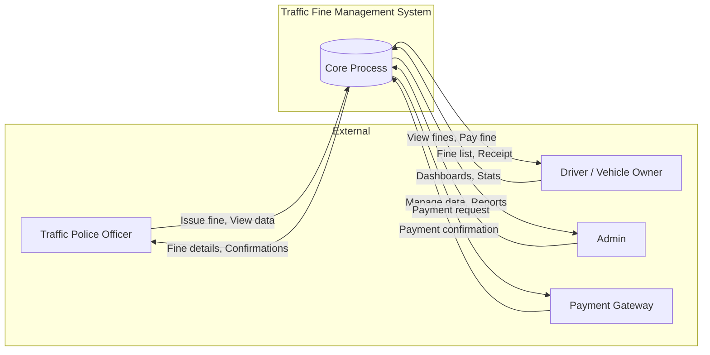
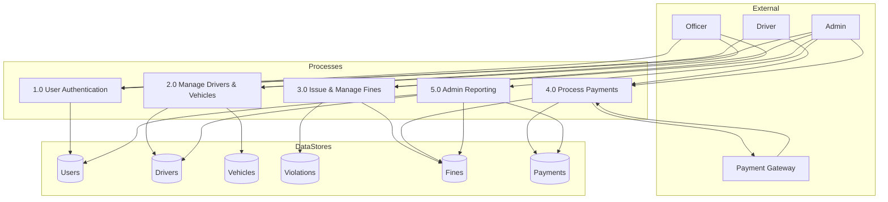
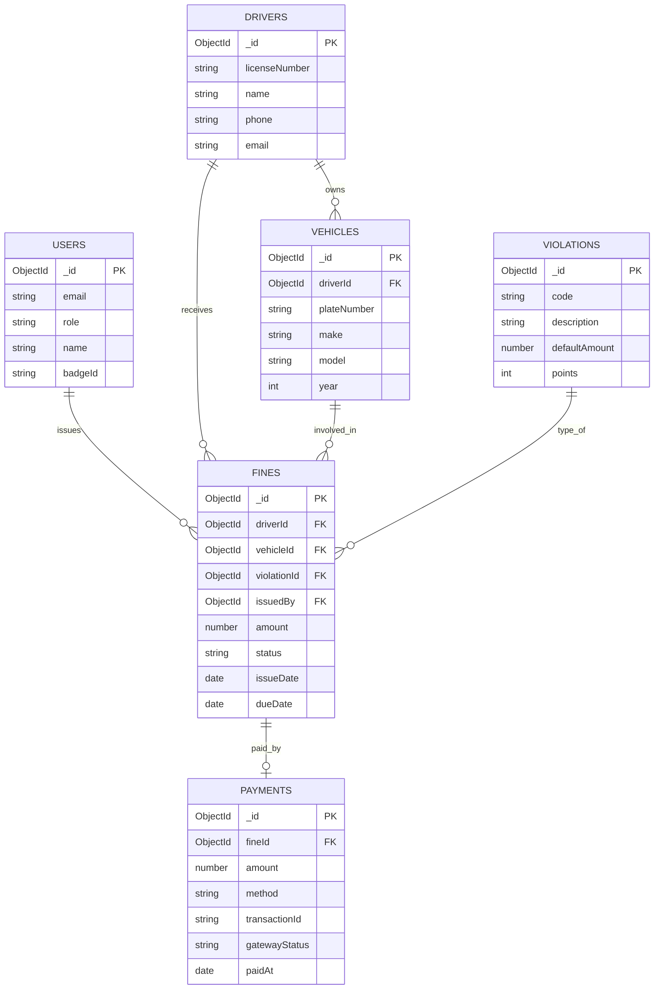

# Traffic Fine Management System — System Design Document

**Academic Project — Full-Stack Design & Implementation**

---

## PHASE 1 — SYSTEM DESIGN

### 1.1 High-Level System Architecture

The system follows a **three-tier architecture**:

```
┌─────────────────────────────────────────────────────────────────────────┐
│                         PRESENTATION LAYER                               │
│  React SPA (TailwindCSS/MUI) — Login, Dashboards, Forms, Pay Fine       │
└─────────────────────────────────────────────────────────────────────────┘
                                    │
                                    │ HTTPS / REST API (Axios)
                                    ▼
┌─────────────────────────────────────────────────────────────────────────┐
│                         APPLICATION LAYER                                │
│  Node.js + Express — REST API, JWT Auth, RBAC, Business Logic            │
└─────────────────────────────────────────────────────────────────────────┘
                                    │
                                    │ Mongoose / MongoDB Driver
                                    ▼
┌─────────────────────────────────────────────────────────────────────────┐
│                         DATA LAYER                                       │
│  MongoDB — Drivers, Vehicles, Violations, Fines, Payments, Users         │
└─────────────────────────────────────────────────────────────────────────┘
```

- **Frontend**: Single Page Application (SPA) for police, admin, and driver roles.
- **Backend**: Stateless REST API; authentication via JWT in headers.
- **Database**: Document store (MongoDB) for flexible schema and relationships via references.

---

### 1.2 Frontend Folder Structure

```
frontend/
├── public/
│   └── index.html
├── src/
│   ├── api/                 # Axios instances & API calls
│   │   ├── axiosConfig.js
│   │   └── endpoints.js
│   ├── components/          # Reusable UI
│   │   ├── common/
│   │   │   ├── Layout.jsx
│   │   │   ├── ProtectedRoute.jsx
│   │   │   └── Table.jsx
│   │   └── ...
│   ├── context/
│   │   └── AuthContext.jsx
│   ├── pages/
│   │   ├── LoginPage.jsx
│   │   ├── PoliceDashboard.jsx
│   │   ├── AdminDashboard.jsx
│   │   ├── DriverDashboard.jsx
│   │   ├── IssueFineForm.jsx
│   │   └── PayFinePage.jsx
│   ├── App.jsx
│   └── index.jsx
├── package.json
└── tailwind.config.js
```

---

### 1.3 Backend Folder Structure (MVC)

```
backend/
├── config/
│   └── db.js              # MongoDB connection
├── controllers/
│   ├── authController.js
│   ├── fineController.js
│   ├── paymentController.js
│   ├── driverController.js
│   ├── vehicleController.js
│   └── adminController.js
├── middleware/
│   ├── auth.js            # JWT verify
│   └── roleCheck.js       # RBAC
├── models/
│   ├── User.js
│   ├── Driver.js
│   ├── Vehicle.js
│   ├── Violation.js
│   ├── Fine.js
│   └── Payment.js
├── routes/
│   ├── authRoutes.js
│   ├── fineRoutes.js
│   ├── paymentRoutes.js
│   ├── driverRoutes.js
│   ├── vehicleRoutes.js
│   └── adminRoutes.js
├── .env.example
├── package.json
└── server.js
```

---

### 1.4 MongoDB Database Design

| Collection   | Purpose |
|-------------|---------|
| **users**  | Officers, admins; login & RBAC (role, hashed password). |
| **drivers**| Citizen drivers; license number, name, contact. |
| **vehicles**| Vehicles linked to drivers; plate, type, make. |
| **violations** | Master list of violation types and default amounts. |
| **fines**   | Issued fines: officer, driver/vehicle, violation, amount, status. |
| **payments**| Payment records linked to fines; gateway simulation. |

**Relationships (logical):**

- `fines.driverId` → `drivers._id`
- `fines.vehicleId` → `vehicles._id`
- `fines.violationId` → `violations._id`
- `fines.issuedBy` → `users._id` (officer)
- `payments.fineId` → `fines._id`

---

### 1.5 Collection Schemas (Mongoose)

#### Users

- **Fields**: `email` (unique), `password` (hashed), `name`, `role` (`admin` | `officer`), `badgeId` (officer), `createdAt`.
- **Validation**: `email` required & valid format; `password` min length; `role` enum.
- **Indexes**: `email` unique; `role` for filtering.

#### Drivers

- **Fields**: `licenseNumber` (unique), `name`, `phone`, `email`, `address`, `createdAt`.
- **Validation**: `licenseNumber` required; `phone`/`email` format.
- **Indexes**: `licenseNumber` unique; `name`, `phone` for search.

#### Vehicles

- **Fields**: `plateNumber` (unique), `driverId` (ref: Driver), `make`, `model`, `year`, `type`, `createdAt`.
- **Validation**: `plateNumber`, `driverId` required; `year` range.
- **Indexes**: `plateNumber` unique; `driverId` for lookups.

#### Violations

- **Fields**: `code`, `description`, `defaultAmount`, `points`, `isActive`, `createdAt`.
- **Validation**: `code` unique; `defaultAmount` ≥ 0.
- **Indexes**: `code` unique; `isActive`.

#### Fines

- **Fields**: `fineNumber` (unique), `driverId`, `vehicleId`, `violationId`, `amount`, `issuedBy` (ref: User), `status` (`pending` | `paid` | `cancelled`), `issueDate`, `dueDate`, `location`, `notes`, `createdAt`.
- **Validation**: refs required; `amount` > 0; `status` enum.
- **Indexes**: `fineNumber` unique; `driverId`, `vehicleId`, `issuedBy`, `status`, `issueDate` for queries.

#### Payments

- **Fields**: `fineId` (ref: Fine), `amount`, `method` (`card` | `upi` | `netbanking`), `transactionId`, `gatewayStatus` (`success` | `failed`), `paidAt`, `createdAt`.
- **Validation**: `fineId`, `amount` required; `gatewayStatus` enum.
- **Indexes**: `fineId`; `transactionId` unique; `paidAt`.

---

### 1.6 REST API Design

| Method | Endpoint | Auth | Role | Description |
|--------|----------|------|------|-------------|
| POST   | `/api/auth/register` | — | — | Register (admin/officer; admin only in practice) |
| POST   | `/api/auth/login` | — | — | Login; returns JWT |
| GET    | `/api/auth/me` | JWT | All | Current user profile |
| GET    | `/api/drivers` | JWT | officer, admin | List/search drivers |
| POST   | `/api/drivers` | JWT | officer, admin | Create driver |
| GET    | `/api/drivers/:id` | JWT | officer, admin | Get driver by ID |
| GET    | `/api/vehicles` | JWT | officer, admin | List vehicles (optional driverId) |
| POST   | `/api/vehicles` | JWT | officer, admin | Register vehicle |
| GET    | `/api/violations` | JWT | officer, admin | List violation types |
| GET    | `/api/fines` | JWT | All | List fines (filtered by role) |
| POST   | `/api/fines` | JWT | officer, admin | Issue fine |
| GET    | `/api/fines/:id` | JWT | All | Get fine details |
| PATCH  | `/api/fines/:id` | JWT | officer, admin | Update fine (e.g. cancel) |
| POST   | `/api/fines/:id/pay` | JWT | driver, admin | Simulate payment |
| GET    | `/api/payments` | JWT | admin | List payments |
| GET    | `/api/admin/stats` | JWT | admin | Dashboard stats |

---

### 1.7 Authentication Flow (JWT)

1. **Login**: Client sends `POST /api/auth/login` with `email` and `password`.
2. **Server**: Validates credentials, returns JWT (payload: `userId`, `email`, `role`) and optional user object.
3. **Client**: Stores JWT (e.g. `localStorage` or memory + httpOnly cookie); sends `Authorization: Bearer <token>` on every request.
4. **Protected routes**: Backend middleware verifies JWT, attaches `req.user`; role middleware restricts by `role`.
5. **Refresh**: Optional refresh token flow; for this project, re-login on expiry is acceptable.

---

### 1.8 Role-Based Access Control (RBAC)

| Role    | Capabilities |
|---------|----------------|
| **admin** | Full access: users, drivers, vehicles, violations, fines, payments, stats. |
| **officer** | Issue fines; view/create drivers and vehicles; view violations; view own fines. |
| **driver** | View own fines (by driverId or linked identity); pay fines. |

Implementation: after `auth` middleware, `roleCheck(['admin','officer'])` (or similar) on routes that require specific roles.

---

### 1.9 Security Considerations

- **Passwords**: Bcrypt hash; never store plain text.
- **JWT**: Signed with secret (env); short expiry (e.g. 24h); HTTPS in production.
- **Input**: Validate and sanitize (e.g. express-validator); prevent NoSQL injection (Mongoose schema + validated inputs).
- **CORS**: Restrict origin to frontend URL in production.
- **Rate limiting**: Apply on auth and payment endpoints.
- **Sensitive data**: Do not log passwords or full tokens.

---

## PHASE 2 — SYSTEM DIAGRAMS

### 2.1 DFD Level 0 (Context Diagram)

**Text:**

- **External entities**: Traffic Police Officer, Driver/Vehicle Owner, Admin, Payment Gateway (simulated).
- **System**: Traffic Fine Management System.
- **Flows**: Officer → System (issue fine, view data); Driver → System (view fines, pay); Admin → System (manage data, view reports); System → Payment Gateway (payment request); Payment Gateway → System (payment confirmation).

**Mermaid:**



---

### 2.2 DFD Level 1

**Text:**

- **Processes**: 1) User Authentication, 2) Manage Drivers & Vehicles, 3) Issue & Manage Fines, 4) Process Payments, 5) Admin Reporting.
- **Data stores**: Users, Drivers, Vehicles, Violations, Fines, Payments.
- **Flows**: Officer/Admin/Driver interact with Authentication; Officer/Admin with Manage Drivers/Vehicles and Issue Fines; Driver/Admin with Process Payments; Admin with Reporting; Payment process reads/writes Fines and Payments and interacts with Gateway.

**Mermaid:**



---

### 2.3 ER Diagram

**Entities**: Drivers, Vehicles, Violations, Fines, Payments, Officers (Users with role=officer), Admins (Users with role=admin). Relationships: Driver owns Vehicles (1:N); Officer issues Fines (1:N); Fine references Driver, Vehicle, Violation; Payment references Fine (N:1).

**Mermaid:**



---

## PHASE 6 — ADVANCED TOPICS

### 6.1 Security Improvements

- Use **httpOnly, secure cookies** for JWT in production to reduce XSS token theft.
- Implement **refresh tokens** with short-lived access tokens.
- Add **helmet** for security headers and **express-rate-limit** on `/auth/login` and `/fines/:id/pay`.
- **Audit logging** for fine issuance and payments (who, when, what).
- **Input validation** on all DTOs (e.g. express-validator) and **output sanitization** to prevent XSS.

### 6.2 Scalability Considerations

- **Stateless API**: No server-side session; scale horizontally behind a load balancer.
- **Database**: Use MongoDB replica set for read scaling; index all query fields.
- **Caching**: Redis for session/rate-limit or for frequently read violation types and stats.
- **Queue**: For payment callbacks or notification emails, use a job queue (e.g. Bull with Redis).

### 6.3 Future Upgrades

- **AI camera detection**: Integrate with camera feeds; image → license plate recognition → match vehicle/driver → auto-create fine (with human review).
- **Automatic violation detection**: Speed/red-light sensors or AI-based lane/signal violations; events pushed to system to create draft fines for officer confirmation.

### 6.4 Deployment Architecture

- **Frontend**: Vercel (connect Git repo; build command `npm run build`; output directory `build` or `dist`).
- **Backend**: Railway or Render; set env vars (`MONGODB_URI`, `JWT_SECRET`, `PORT`); deploy from Git or Dockerfile.
- **Database**: MongoDB Atlas (free tier); allow connection from Railway/Render IP or use Atlas network access (0.0.0.0/0 for demo only).
- **Flow**: User → Vercel (React) → API calls to Railway/Render URL → Express → MongoDB Atlas.

---

*End of System Design Document. Implementation details follow in codebase and RUN_INSTRUCTIONS.md.*
