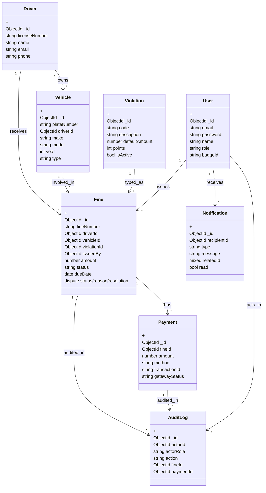
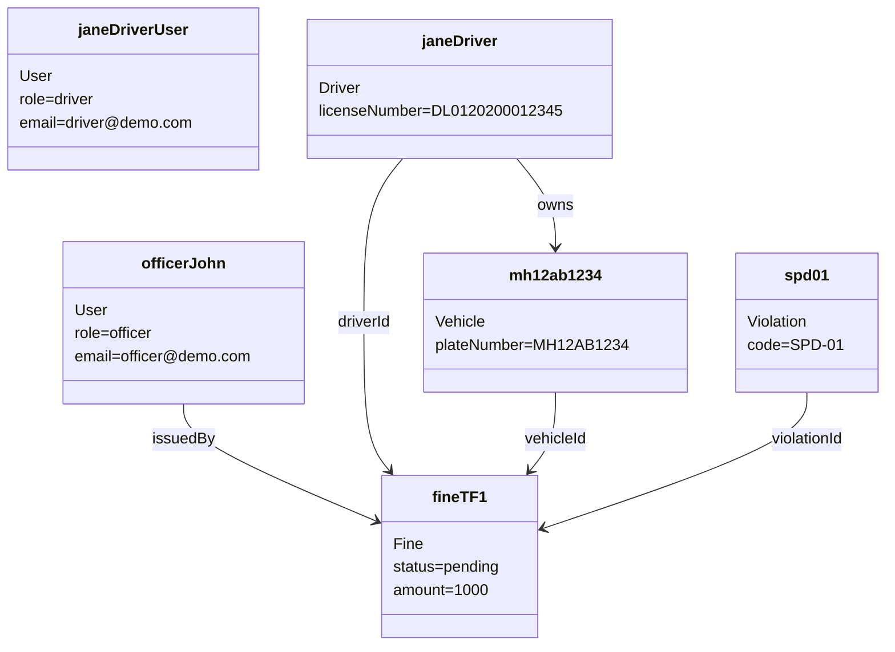

# Traffic Fine Management System — Implemented-System History & UML Analysis

## 1) Purpose, Scope, Assumptions, Terminology

### Purpose
This project is a full-stack web system for managing traffic fines: user authentication, driver/vehicle records, fine issuance, fine payment simulation, disputes, notifications, and admin reporting.

### Scope (implemented)
- Multi-role authentication (`admin`, `officer`, `driver`)
- Driver self-signup and profile management
- CRUD-like operations for drivers, vehicles, violations, and users (with role limits)
- Fine lifecycle management (issue, edit, cancel, pay)
- Dispute submission/resolution on fines
- Notification inbox per user
- Admin dashboard stats and audit logs

### Out-of-scope / not implemented in code
- No real payment gateway integration (payment is simulated as success)
- No appeals module separate from fine disputes
- No file uploads, court workflow, or escalation engine
- No automated camera ingestion

### Assumptions reflected by code
- Driver-to-user linkage is by **email match** (not a direct foreign key)
- JWT bearer token auth with localStorage client storage
- MongoDB is primary persistence

### Key terminology
- **Fine**: monetary penalty tied to one driver, one vehicle, one violation, and issuing officer/admin.
- **Dispute**: embedded sub-state in Fine (`none|pending|accepted|rejected`).
- **Payment**: simulated successful payment event that marks a fine paid.
- **Notification**: user-facing message about fine/payment events.
- **Audit Log**: immutable event record for key fine/payment actions.

---

## 2) Technology Stack & High-Level Architecture

| Layer | Technology | Notes |
|---|---|---|
| Frontend | React + Vite + React Router + Axios + Tailwind | SPA with route guards and role-based page access |
| Backend | Node.js + Express | REST API, JWT auth middleware, role-check middleware |
| Data | MongoDB + Mongoose | Document models with indexes/validation |
| Auth | JWT bearer token | Token generated on login/register/signup |

### Runtime architecture
1. Browser SPA calls `/api/*` endpoints through Axios.
2. Express routes call auth middleware and optional role middleware.
3. Controllers apply business rules and persist to MongoDB via Mongoose models.
4. Responses drive SPA views (dashboards, forms, tables).

---

## 3) Major Components and Responsibilities

## Backend
- `server.js`: app bootstrap, middleware (`cors`, `express.json`), route mount points.
- `middleware/auth.js`: JWT verification + current user load.
- `middleware/roleCheck.js`: RBAC guard.
- `controllers/*.js`: business flows (auth, fines, payments, users, stats, etc.).
- `models/*.js`: domain schema, validation, indexes.
- `utils/auditLog.js`: non-blocking audit event creation.

## Frontend
- `App.jsx`: route map + role-gated pages.
- `context/AuthContext.jsx`: login/logout/session state.
- `api/endpoints.js`: typed endpoint wrappers.
- `pages/*`: workflow screens (issue fine, pay fine, users, profile, etc.).
- `components/common/NotificationBell.jsx`: notification polling + quick actions.

---

## 4) Actors, Roles, Permissions, External Systems

| Actor | Authentication | Main capabilities |
|---|---|---|
| Admin | Required | View system stats, audit logs, manage users, create/manage fines, view all payments, resolve disputes |
| Officer | Required | Issue/manage own fines, manage drivers/vehicles, create violations, resolve disputes on own fines |
| Driver | Required (or self-signup) | View own fines, pay own fines, submit disputes, view own payments, manage own vehicles/profile |
| External Payment System | Not truly integrated | Simulated in backend (`gatewayStatus: success`) |

RBAC enforcement exists both in frontend route guards and backend route middleware.

---

## 5) API/Route Map (Implemented)

| Method | Endpoint | Roles allowed | Behavior summary |
|---|---|---|---|
| POST | `/api/auth/signup` | Public | Creates driver user + driver record (+ optional vehicle) |
| POST | `/api/auth/register` | Public in route (intended admin workflow) | Creates user with provided role |
| POST | `/api/auth/login` | Public | Returns JWT + user payload |
| GET | `/api/auth/me` | Authenticated | Current user profile (+ driver profile for drivers) |
| PATCH | `/api/auth/me` | Authenticated | Update own profile |
| GET/POST | `/api/drivers` | Admin/Officer | List/create drivers |
| GET | `/api/drivers/:id` | Admin/Officer | Get driver |
| GET/POST | `/api/vehicles` | Admin/Officer | List/create vehicles |
| GET/POST | `/api/vehicles/my` | Driver | List/create current driver’s vehicles |
| GET/POST | `/api/violations` | Admin/Officer | List active/create violation |
| GET/POST | `/api/fines` | All (GET), Admin/Officer (POST) | List by role filters / issue fine |
| GET | `/api/fines/:id` | All role-scoped | Get one fine with access checks |
| PATCH | `/api/fines/:id` | Admin/Officer | Update/cancel fine (cannot update paid fine) |
| POST | `/api/fines/:id/dispute` | Driver | Submit dispute on own fine |
| PATCH | `/api/fines/:id/dispute` | Admin/Officer | Resolve dispute (`accepted`/`rejected`) |
| POST | `/api/fines/:id/pay` | Driver/Admin | Simulate payment and mark paid |
| GET | `/api/payments` | Admin/Driver | List payments (driver restricted to own fine IDs) |
| GET | `/api/admin/stats` | Admin | Aggregate KPIs and monthly metrics |
| GET | `/api/admin/audit-logs` | Admin | Read audit history |
| GET | `/api/users` | Admin | List users |
| POST | `/api/users` | Admin | Create user (supports driver + optional vehicle) |
| PATCH/DELETE | `/api/users/:id` | Admin | Update/delete with admin-protection rules |
| GET | `/api/notifications` | Authenticated | User’s notifications + unread count |
| PATCH | `/api/notifications/read-all` | Authenticated | Mark all read |
| PATCH | `/api/notifications/:id/read` | Authenticated | Mark one read |

---

## 6) Detailed Use Cases

## UC1: Login
- **Trigger:** User submits email/password on Login page.
- **Preconditions:** User account exists; password hash matches.
- **Main flow:** `POST /auth/login` -> JWT + user -> frontend stores token/user -> route redirect by role.
- **Alternate/error:** Invalid credentials -> 401 message.
- **Postconditions:** Authenticated session established in localStorage.

## UC2: Driver self-signup
- **Trigger:** New driver submits signup form.
- **Preconditions:** Email unique; password >= 6.
- **Main flow:** Creates `User(role=driver)` -> creates `Driver` record -> optionally creates `Vehicle` -> returns token/user.
- **Alternate/error:** Duplicate email/license/plate checks can fail with 400.
- **Postconditions:** Driver can log in and appear in fine issuance flows.

## UC3: Issue fine (officer/admin)
- **Trigger:** Officer/admin submits Issue Fine form.
- **Preconditions:** Auth + role; valid driver/vehicle/violation IDs; amount > 0.
- **Main flow:** Create `Fine` with generated `fineNumber` and `issuedBy` -> notify matching driver user (if found by email) -> add audit log.
- **Alternate/error:** Validation/database errors -> 500/400 responses.
- **Postconditions:** Fine status starts as `pending`.

## UC4: View/search fines
- **Trigger:** Any role opens fines page.
- **Preconditions:** Authenticated.
- **Main flow:** GET list with role scoping: driver sees own (email-mapped), officer sees issued-by-self, admin sees all; optional status/dispute/search filters.
- **Alternate/error:** Missing driver mapping for a driver account -> empty list.
- **Postconditions:** Fine list rendered; role-specific actions displayed.

## UC5: Pay fine (driver/admin)
- **Trigger:** User confirms payment on pay page.
- **Preconditions:** Fine exists and not already paid; driver may pay only own fine.
- **Main flow:** Create `Payment(gatewayStatus=success)` -> set fine status `paid` -> create notifications (officer/admin/driver) -> write audit log.
- **Alternate/error:** Paying non-owned fine (driver) -> 403; amount lower than fine -> 400.
- **Postconditions:** Fine moves to `paid`; payment record persists.

## UC6: Dispute and resolve dispute
- **Trigger A (driver):** Submit dispute reason.
- **Trigger B (admin/officer):** Resolve pending dispute with decision.
- **Preconditions:** A: fine owned by driver and disputable. B: pending dispute + role/ownership rule.
- **Main flow A:** Set dispute status `pending`, reason, requestedAt; audit log.
- **Main flow B:** Set dispute status to `accepted` or `rejected`, set resolver metadata; if accepted and unpaid, cancel fine.
- **Alternate/error:** Duplicate pending dispute, cancelled fine dispute attempt, non-pending resolution.
- **Postconditions:** Dispute sub-state updated and auditable.

## UC7: Admin user management
- **Trigger:** Admin creates/edits/deletes user.
- **Preconditions:** Admin authenticated.
- **Main flow:** CRUD-like operations through `/users`; driver users may auto-create/update matching `Driver` record.
- **Alternate/error:** Cannot delete self; admin users cannot be modified/removed by another admin.
- **Postconditions:** User base updated with guardrails.

## UC8: Driver vehicle self-management
- **Trigger:** Driver adds vehicle in “My Vehicles”.
- **Preconditions:** Driver profile exists (by email mapping).
- **Main flow:** POST `/vehicles/my` creates vehicle tied to mapped driver ID.
- **Alternate/error:** Missing driver profile -> 404.
- **Postconditions:** Vehicle available for driver and potentially future fines.

## UC9: Admin analytics and audit review
- **Trigger:** Admin opens dashboard/audit pages.
- **Preconditions:** Admin authenticated.
- **Main flow:** Aggregation queries for totals/monthly trends/top violations; audit log retrieval with optional action filter.
- **Postconditions:** Operational visibility and traceability.

---

## 7) Domain Entities / Classes

| Class | Core attributes | Behaviors / rules |
|---|---|---|
| `User` | `email(unique)`, `password(hash)`, `name`, `role(admin/officer/driver)`, `badgeId?`, timestamps | Password hashed pre-save; comparePassword method; role-driven access |
| `Driver` | `licenseNumber(unique)`, `name`, `phone?`, `email?`, `address?`, timestamps | Lookup/search; linked to user primarily by email convention |
| `Vehicle` | `plateNumber(unique)`, `driverId(ref Driver)`, `make?`, `model?`, `year?`, `type enum`, timestamps | Created by admin/officer or driver-self flow |
| `Violation` | `code(unique)`, `description`, `defaultAmount>=0`, `points>=0`, `isActive`, timestamps | Master data for fine issuance |
| `Fine` | `fineNumber(unique)`, `driverId`, `vehicleId`, `violationId`, `amount>0`, `issuedBy(User)`, `status`, `issueDate`, `dueDate`, `location?`, `notes?`, `dispute{...}`, timestamps | Role-scoped querying, update restrictions, dispute workflow, payment transition |
| `Payment` | `fineId`, `amount>0`, `method enum`, `transactionId`, `gatewayStatus`, `paidAt`, timestamps | Created by pay flow; fine set to paid |
| `Notification` | `recipientId(User)`, `type`, `message`, `relatedId(mixed)`, `read`, timestamps | Poll/read/mark-all-read flows |
| `AuditLog` | `actorId?`, `actorName?`, `actorRole`, `action`, `fineId?`, `paymentId?`, `details?`, `metadata?`, timestamps | Non-blocking writes for key events |

---

## 8) Relationships and Multiplicities

- `Driver 1 --- * Vehicle` (one driver can own many vehicles)
- `Driver 1 --- * Fine` (one driver can receive many fines)
- `Vehicle 1 --- * Fine` (one vehicle can appear in many fines)
- `Violation 1 --- * Fine` (one violation type referenced by many fines)
- `User(officer/admin) 1 --- * Fine` via `issuedBy`
- `Fine 1 --- * Payment` (code permits multiple payment records, though normal flow suggests one final successful payment)
- `User 1 --- * Notification`
- `User/Fine/Payment --- * AuditLog` associations by optional refs

### Inheritance/generalization note
No explicit inheritance in code. Role polymorphism is implemented by `User.role` plus RBAC checks.

### Composition/aggregation note
- `Fine` **composes** embedded `dispute` subdocument (lifecycle bound to Fine).
- Other references are aggregation/association via ObjectId refs.

---

## 9) Lifecycle / State Models

## Fine state (payment + dispute)
1. Created as `pending`.
2. Can be updated while pending.
3. Can be `cancelled` by privileged role (blocked after due date by rule).
4. Can be `paid` via payment flow.
5. Dispute sub-state independent but constrained:
   - `none` -> `pending` by driver
   - `pending` -> `accepted` or `rejected` by admin/officer
   - If accepted and fine not paid, fine status becomes `cancelled`

## Notification state
- `read=false` on creation.
- Transition to `read=true` by individual mark or bulk mark-all.

---

## 10) Runtime/Object Collaboration Scenarios

## Scenario A: Officer issues fine
Example objects:
- `u_officer:User{role=officer}`
- `d_jane:Driver{license=DL...}`
- `v_mh12:Vehicle{plate=MH12AB1234}`
- `vio_spd:Violation{code=SPD-01}`
- `f_1:Fine{status=pending}`
- `n_1:Notification{type=fine_issued}`
- `a_1:AuditLog{action=fine_issued}`

Sequence:
1. Officer submits issue form.
2. Backend creates `f_1` with generated `fineNumber` and references.
3. Backend finds driver user by email and creates `n_1`.
4. Backend writes `a_1`.
5. API returns populated fine.

## Scenario B: Driver pays fine
Objects:
- `u_driver:User{role=driver}`
- `f_1:Fine{status=pending}`
- `p_1:Payment{gatewayStatus=success}`
- `n_officer`, `n_admin`, `n_driver`: Notification
- `a_2:AuditLog{action=fine_paid}`

Sequence:
1. Driver opens pay page and confirms.
2. Backend verifies ownership and amount.
3. Creates `p_1`, sets `f_1.status=paid`.
4. Creates recipient notifications.
5. Writes `a_2`.
6. Returns payment + updated fine payload.

## Scenario C: Driver disputes, officer resolves
1. Driver submits reason -> fine.dispute becomes `pending`.
2. Officer/admin resolves with `accepted` or `rejected`.
3. If `accepted` and unpaid -> fine status auto-cancelled.
4. Audit events written for both steps.

---

## 11) Data Flow, Request Flow, Persistence Flow, Business Rules

### Request flow
Frontend action -> Axios endpoint wrapper -> Express route -> `protect` -> optional `roleCheck` -> controller -> Mongoose model operations -> JSON response.

### Persistence flow
- Controllers mostly use direct model methods (`find`, `create`, `save`, `aggregate`) with `populate` for references.
- Important write side effects:
  - Fine creation/update/payment/dispute writes audit logs.
  - Fine creation/payment writes notifications.

### Key business rules grounded in code
- Driver scope is resolved by `Driver.email == req.user.email` for fines/payments/vehicles.
- Paid fine cannot be updated.
- Fine cannot be cancelled after due date.
- Driver can pay/dispute only own fines.
- Dispute resolution requires pending dispute.
- Cross-admin safety: admin users cannot be edited/deleted by another admin; self-delete blocked.

---

## 12) UML-Ready Textual Specification

### Use-case diagram guidance
- System boundary: “Traffic Fine Management System”.
- Actors: Admin, Officer, Driver.
- Core use cases: Login, Manage Profile, Manage Drivers, Manage Vehicles, Manage Violations, Issue Fine, View/Search Fines, Pay Fine, Submit Dispute, Resolve Dispute, Manage Users, View Payments, View Stats, View Audit Logs, View/Mark Notifications.
- Include role-based include/exclude constraints via notes.

### Class diagram guidance (Mermaid)

### Object diagram seed example (Mermaid)

---

## 13) Traceability Notes and Uncertainty

### Primary source files used
- Backend bootstrapping and routes:
  - `backend/server.js`
  - `backend/routes/*.js`
- Domain models:
  - `backend/models/User.js`, `Driver.js`, `Vehicle.js`, `Violation.js`, `Fine.js`, `Payment.js`, `Notification.js`, `AuditLog.js`
- Business logic:
  - `backend/controllers/authController.js`, `fineController.js`, `paymentController.js`, `userController.js`, `adminController.js`, `vehicleController.js`, `driverController.js`, `violationController.js`, `notificationController.js`
  - `backend/utils/auditLog.js`
- Frontend workflows:
  - `frontend/src/App.jsx`, `context/AuthContext.jsx`, `api/endpoints.js`
  - `frontend/src/pages/*.jsx` (IssueFineForm, FinesListPage, PayFinePage, AdminUsersPage, ProfilePage, MyVehiclesPage, NotificationsPage, AdminDashboard, AuditLogsPage, DriverDashboard, PoliceDashboard)

### Explicit uncertainty/inference markers
- **Email-based user-driver linkage** is inferred as architectural convention because many controllers map driver data by matching email, not FK.
- **One fine to many payments** is schema-permitted and code-tolerated, though normal UI flow suggests one successful payment per fine.
- **`/auth/register` openness**: route allows public call; intended governance appears administrative by design docs/UI, but backend route itself is not role-protected.
- Documentation in `docs/` contains broader conceptual material; this file prioritizes **implemented behavior in code**.
